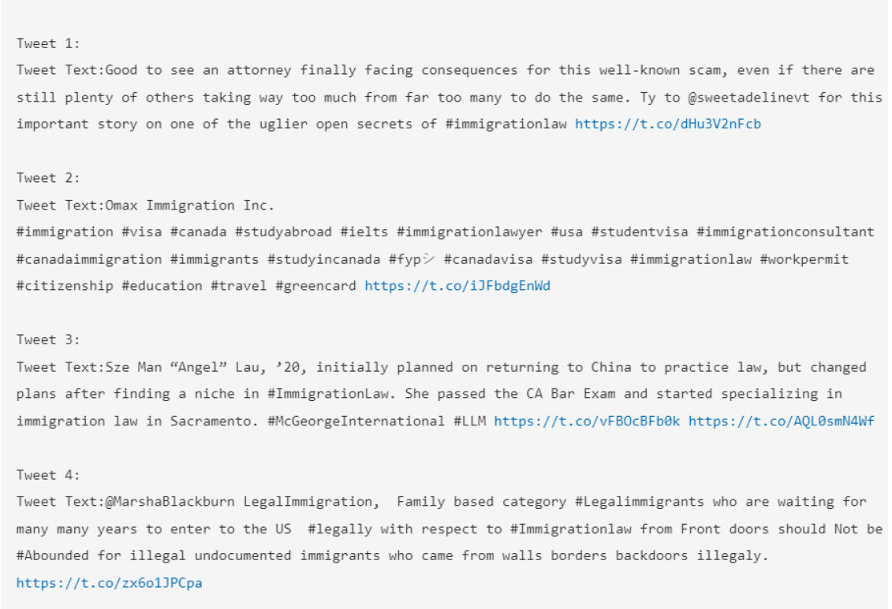
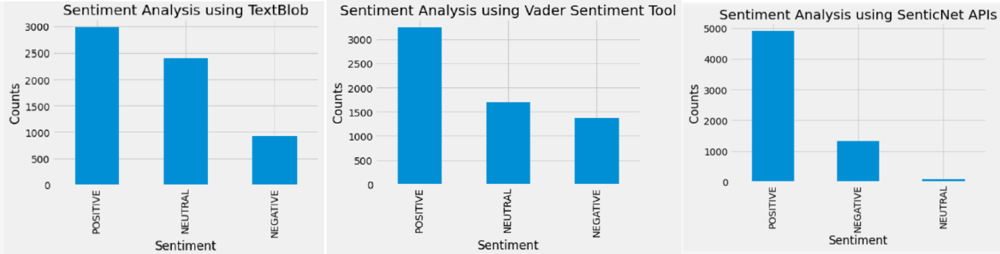
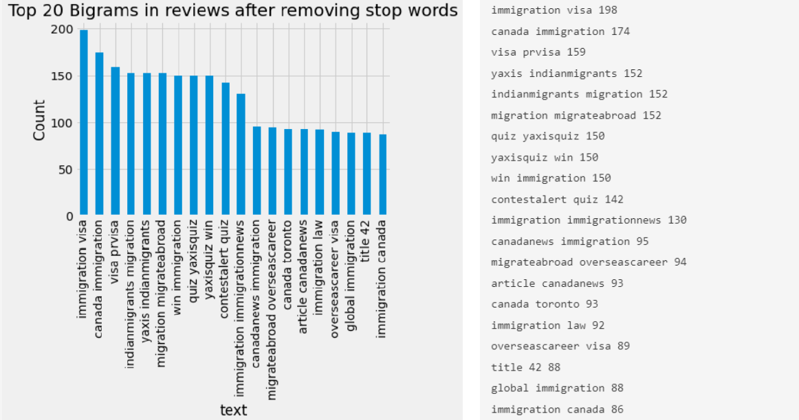
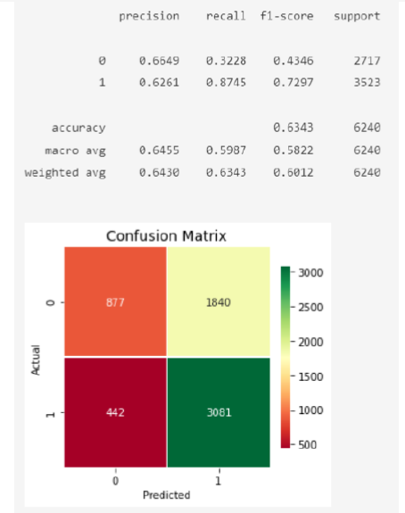

# Immigration-Reforms-SenticNet-Computing-Analysis

## Overview
This project conducts a comprehensive sentiment analysis on the topic of immigration reforms, utilizing tweets to understand public sentiment. Using advanced Natural Language Processing (NLP) techniques, this research aimed to discern the overall sentiment towards immigration policies, highlighting the division in public opinion across different geographies.

> Note: For a detailed understanding and the step by step process please refer the attached Report while following the code in ipynb. This was conducted as part of Research at NTU for <a href="https://sentic.net/">SenticNet</a>, year 2022.

## Table of Contents
- [Technologies and Algorithms](#technologies-and-algorithms)
- [Data Collection](#data-collection)
- [Analysis](#analysis)
- [Results](#results)
- [Visualization](#visualization)
- [References](#references)

## Technologies and Algorithms
This project uses the following technologies and algorithms for analyzing sentiment data:
- **Python**
- **Tweepy**: Python library for accessing the Twitter API.
- **TextBlob and VADER**: Libraries for sentiment analysis.
- **SenticNet APIs**: Utilized for polarity classification and concept parsing error analysis compared to TextBlob and Vader
- **Gensim**: Used for training word embeddings with Word2Vec models.
- **Pandas & NumPy**: data manipulation and numerical analysis.
- **Matplotlib & Seaborn**: creating visualizations.
- **Scikit-learn**: model training and evaluation metrics.

## Data Collection
Data is collected from Twitter using Python's `Tweepy` library, focusing on tweets tagged with specific hashtags related to immigration, such as #immigration and #visa. Over 21k tweets were fetched, cleaned, and prepared for analysis.

## Analysis
The sentiment analysis is performed using multiple methods:
- **Polarity Classification**: Using SenticNet, TextBlob, and VADER to label tweets as positive, negative, or neutral.
- **Concept Parsing**: Analysed the concepts used for the polarity with SenticNet and compared against popular libraries.
- **Word Embeddings**: Training Word2Vec models on the collected data to analyze semantic similarities.

## Results
Results indicate varied sentiments across different regions with detailed polarity insights:
- **Positive Sentiments**: Predominantly observed supportive views towards immigrants.
- **Negative Sentiments**: Focused on economic concerns and national security.
- **Neutral Sentiments**: Often related to news reports or unbiased statements.

Each sentiment is visually represented through word clouds and bar graphs to depict the frequency and impact of specific terms.

## Visualization
Several visualizations are included to represent the data effectively, everything is included as part of the report:
1. **Word Clouds**: Showing the most frequent words in different sentiment categories.
2. **Bar Graphs**: Displaying the count of tweets in each sentiment category.
3. **Sentiment Distribution**: Comparison between different sentiment analysis tools.

Common bigram (two-word combinations) frequencies and to plot these frequencies as a bar chart:

The bar graph visually represents the frequency of each bigram, with the y-axis labeled "Count" and the x-axis listing the bigrams such as "immigration visa," "canada immigration," "visa prvisa," and others. The most frequent bigram appears to be "immigration visa" with a count close to 200, indicating it's a common topic in the dataset analyzed. This type of analysis helps in understanding key themes or topics within a large text corpus, often used in sentiment analysis, market research, or content strategy.

### Semantic Sentiment Scores by OSSA model

The unsupervised learning approach is a method for sentiment analysis known as Semantic Similarity Analysis (SSA). This approach involves several key steps:

1. **Word Embedding Training**: Initially, a word embedding model is trained using all available text data, such as tweets. This model creates a space where the similarity between words can be measured, with cosine similarity used as the metric to determine semantic relevance.

2. **Sentiment Prediction**: Two specific sets of words, each carrying either positive or negative sentiments, are identified. To predict the sentiment of a given text, its similarity to these positive and negative word sets is calculated in the word embedding space. The sentiment that the text is most closely aligned with, based on this similarity, determines its classification.

3. **Utility Functions in the w2v_utils Module**:
   - **Tokenizer**: A class that cleans, de-noises, and tokenizes the text, preparing it for further processing.
   - **w2v_trainer**: Trains a Word2Vec model with the cleaned and tokenized documents, returning both vectors for each word (keyed vectors) and a vocabulary of keys (keyed vocabs).
   - **evaluate_model**: Calculates and returns various performance metrics such as F1 Score, Accuracy, Recall, and Precision.
   - **overall_semantic_sentiment_analysis**: This function computes a vector for the entire text by averaging its word vectors. It then assesses the semantic sentiment by calculating the cosine similarities between this text vector and predefined vectors representing positive and negative sentiments.
   - **topn_semantic_sentiment_analysis**: Analyzes the semantic sentiment of a list of tokenized text documents. It uses the function `calculate_topn_similarity_score` to determine sentiment based on how closely the text aligns with the top-n similar words in either the positive or negative sets.

This approach leverages deep learning techniques and natural language processing to effectively analyze and classify sentiments in text data without the need for labeled training data, for understanding large volumes of unstructured text.

## References
Detailed references and citations are provided to ensure replicability and verification of the research methodology and findings.

> Plagiarism is strictly discouraged and urge all users to maintain Academic integrity. If you use or adapt this project's content, please ensure you give proper credit. 
